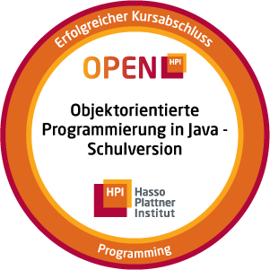
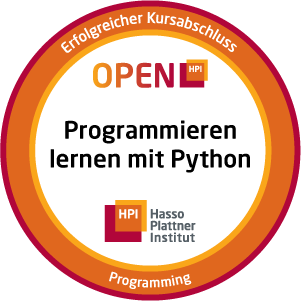

# 👋 Hi, I'm Apfelholz

<table>
<tr>
<td>

### 🏫 About Me
I'm a student at the Diltheyschule Wiesbaden, where I'm also active in the Schülerverwaltung (SV).

### 🚀 What I Do
- Initiator and member of [BugBusters](https://github.com/Bug-Busters-dev), competing in the BWINF  
- Successful participant in the BWINF (Bundeswettbewerb Informatik)  
- Completed my Schülerpraktikum at GSI FAIR in Darmstadt  

### 🛠️ Languages
- Java ☕
- Python 🐍
- C++ ⚙️

### 🌱 Interests
- Playing the trumpet 🎺  
- Windsurfing 🌊  
- Pebble ⌚

### 📫 Connect

</td>
<td>

  

    
  

  

    
  

  

    
    
  

</td>
</tr>
</table>
